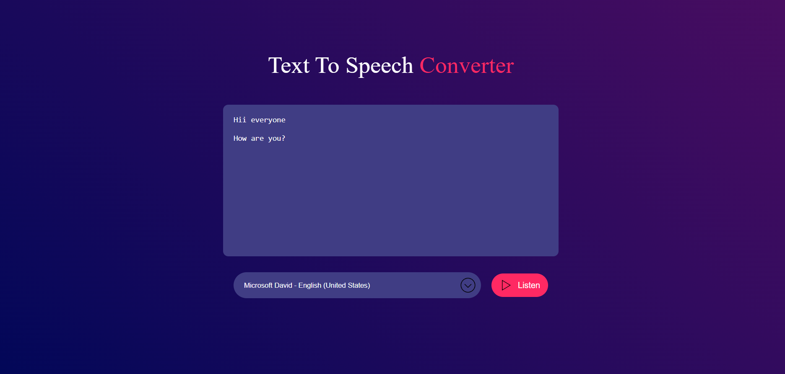

# Text-To-Speech Converter

## 📌 Overview
The **Text-To-Speech Converter** is a web-based application built using HTML, CSS, and JavaScript. It allows users to convert text input into speech output directly in their browser using the Web Speech API.

## 🚀 Features
- Converts text to speech in real-time
- Supports multiple voices (based on browser support)
- Simple and user-friendly interface
- No external dependencies required

## 🛠️ Installation
To run this project on your local machine, follow these steps:

### Steps to Install
1. Clone this repository:
   ```sh
   git clone https://github.com/ankita34359/Text-To-Speech-Converter.git
   cd Text-To-Speech-Converter
   ```

2. Open the `index.html` file in your browser.

## 🎤 Usage
1. Enter the text you want to convert in the provided textarea.
2. Select a voice (if multiple voices are available).
3. Click the "Listen" button to hear the converted speech.

## 📜 Technologies Used
- **HTML**: Structure of the application
- **CSS**: Styling and layout
- **JavaScript**: Functionality using Web Speech API

## 📷 Screenshots



## Live Demo


## 📜 License
This project is licensed under the MIT License. See the [LICENSE](LICENSE) file for details.

## 📬 Contact
For any inquiries or support, feel free to contact:
- **Name**: Ankita
- **GitHub**: [@ankita34359](https://github.com/ankita34359)

---

⭐ If you find this project helpful, please consider giving it a star!
